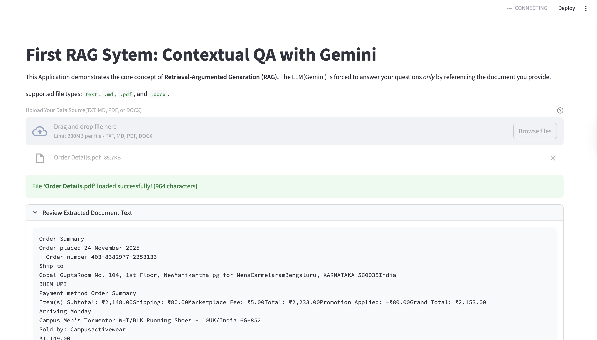

# Gemini RAG System: Contextual QA

A **Retrieval-Augmented Generation (RAG)** system built with **Python** and **Streamlit**.  
This application allows you to upload a document (`.txt`, `.md`, `.pdf`, `.docx`) and ask questions. The system forces the **Gemini LLM** to answer **only using the content of the uploaded document**, providing **grounded and accurate responses**.

---

## Features

- Upload multiple document types: `txt`, `md`, `pdf`, `docx`.  
- Automatically extracts text from documents.  
- Ask questions based on uploaded content.  
- LLM responds **only using document content**, ignoring external knowledge.  
- Clear and professional **Streamlit interface**.

---

## Installation

1. Clone the repository:

```bash
git clone <your-github-repo-url>
cd <repo-folder>
```
2. Create a virtual environment:

```bash
python3 -m venv .venv
source .venv/bin/activate  # On macOS/Linux
.venv\Scripts\activate     # On Windows
```


3. Install dependencies:


```bash
pip install -r requirements.txt
```

Make sure pypdf and python-docx are installed for PDF and DOCX support.

## Usage

1. Run the Streamlit app:

```bash
streamlit run RAG.py
```

2. Upload your document (TXT, MD, PDF, DOCX).

3. Enter a question in the text box.

4. Click Get Grounded Answer to see the response.

## Files

- `RAG.py` – Main Streamlit application.
- `.gitignore` – Excludes virtual environment, cache, and temporary files.
- `requirements.txt` – Python dependencies for the project.

## Example Screenshot




## License

This project is open-source under the MIT License.

## Key Takeaways

Demonstrates RAG concept using LLMs.

Forces the LLM to act as a document reader.

Supports multiple document formats and handles large texts gracefully.


---

💡 **Next step (recommended):**  

Create a `requirements.txt` file so anyone can install dependencies easily:

```bash
pip freeze > requirements.txt
```
